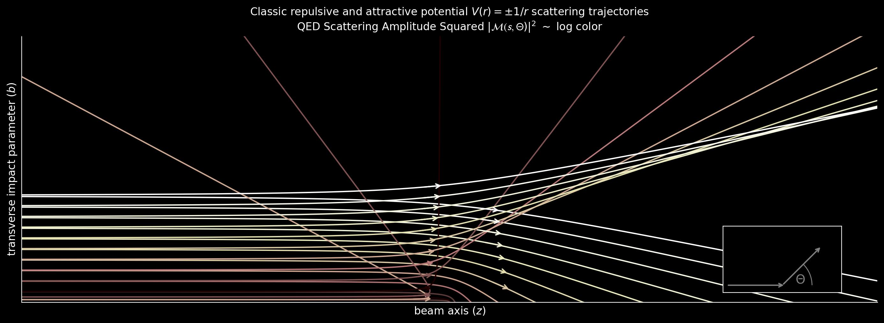

## Synthetic Quantum Electrodynamics via Generative AI

**AI in Science tutorial given at AIMS, Cape Town, South Africa, 2025**

<div style="display: flex; flex-wrap: wrap; justify-content: space-between; gap: 10px;">
  
</div>
<div style="display: flex; flex-wrap: wrap; justify-content: space-between; gap: 10px;">
  
</div>

<br>

**Mikael Mieskolainen** <br>
Department of Physics and I-X Centre for AI in Science, Imperial College London <br>
m.mieskolainen@imperial.ac.uk <br>

[](https://opensource.org/licenses/MIT)

---

### Environment setup

```
conda env create -f environment.yml
conda activate aims25
pip install -r requirements.txt
```

### Notebooks

[](https://colab.research.google.com/github/mieskolainen/AIMS25/blob/main/tutorial_part_1.ipynb) **Part 1**: Physics Theory 

[](https://colab.research.google.com/github/mieskolainen/AIMS25/blob/main/tutorial_part_2.ipynb) **Part 2**: AI Theory 

[](https://colab.research.google.com/github/mieskolainen/AIMS25/blob/main/tutorial_part_3.ipynb) **Part 3**: Surrogate Simulator 

[](https://colab.research.google.com/github/mieskolainen/AIMS25/blob/main/tutorial_part_4.ipynb) **Part 4**: Amortized Bayesian Posterior 

[](https://colab.research.google.com/github/mieskolainen/AIMS25/blob/main/tutorial_part_5.ipynb) **Part 5**: Deep Inverse Problems

See `environment.yml` and `requirements.txt` for Python and library versions.

### Python files

```
xaims/qedgen.py     - QED 2->2 Monte Carlo event generator

xaims/flows.py      - Coupling based Normalizing Flows
xaims/splines.py    - Splines for Spline Couplings
xaims/ddpm.py       - Discrete-time DDPM diffusion
xaims/sde.py        - Continuous-time SDE diffusion

xaims/transforms.py - Pre-processing transforms
xaims/aux.py        - Auxialiary functions
xaims/visualize.py  - Plotting functions
xaims/coolplots.py  - Illustrative simulations
```


### Reference

If you use this in your work, you can cite the repository:
```
@software{aims25,
  author  = "{Mikael Mieskolainen}",
  title   = "Synthetic Quantum Electrodynamics via Generative AI",
  url     = "https://github.com/mieskolainen/aims25",
  version = {0.1},
  date    = {2025-XX-YY},
}
```
